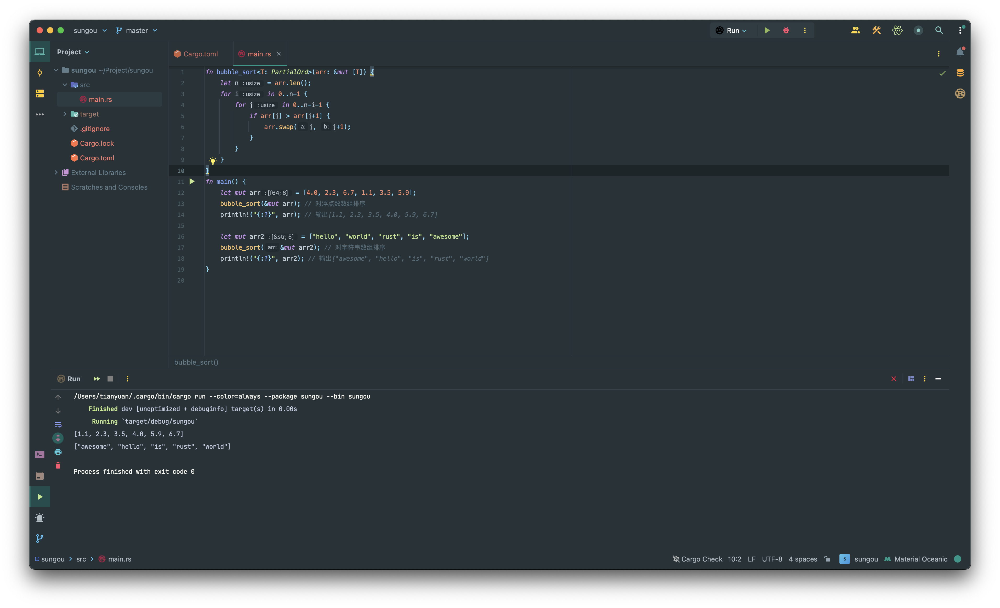

```
fn bubble_sort(arr: &mut [i32]) {
    let n = arr.len();
    for i in 0..n-1 {
        for j in 0..n-i-1 {
            if arr[j] > arr[j+1] {
                arr.swap(j, j+1);
            }
        }
    }
}

fn main() {
    let mut arr = [4, 2, 6, 1, 3, 5];
    bubble_sort(&mut arr);
    println!("{:?}", arr); // 输出[1, 2, 3, 4, 5, 6]
}
```


```
fn bubble_sort<T: PartialOrd>(arr: &mut [T]) {
    let n = arr.len();
    for i in 0..n-1 {
        for j in 0..n-i-1 {
            if arr[j] > arr[j+1] {
                arr.swap(j, j+1);
                }
            }
       }
}
```
```
fn main() {
let mut arr = [4.0, 2.3, 6.7, 1.1, 3.5, 5.9];
bubble_sort(&mut arr); // 对浮点数数组排序
println!("{:?}", arr); // 输出[1.1, 2.3, 3.5, 4.0, 5.9, 6.7]

let mut arr2 = ["hello", "world", "rust", "is", "awesome"];
bubble_sort(&mut arr2); // 对字符串数组排序
println!("{:?}", arr2); // 输出["awesome", "hello", "is", "rust", "world"]
}
```

