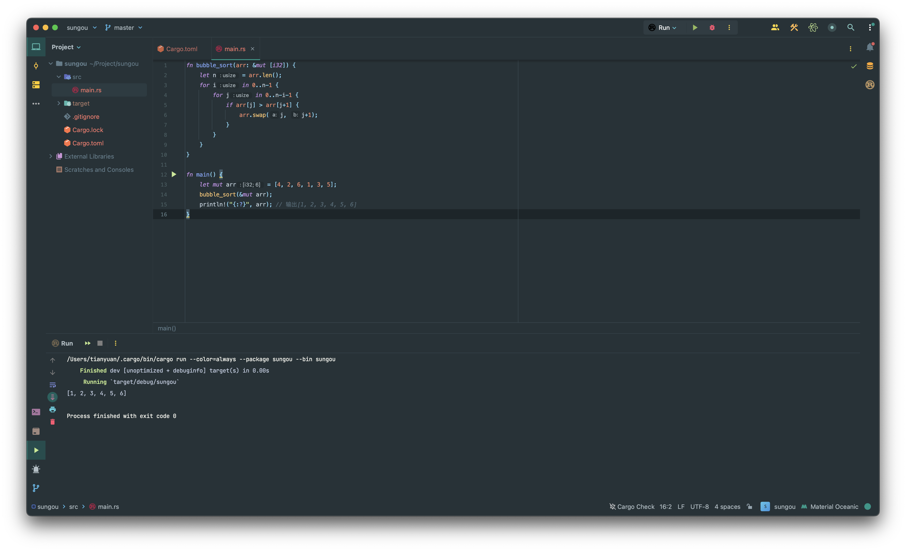

```
fn bubble_sort(arr: &mut [i32]) {
    let n = arr.len();
    for i in 0..n-1 {
        for j in 0..n-i-1 {
            if arr[j] > arr[j+1] {
                arr.swap(j, j+1);
            }
        }
    }
}

fn main() {
    let mut arr = [4, 2, 6, 1, 3, 5];
    bubble_sort(&mut arr);
    println!("{:?}", arr); // 输出[1, 2, 3, 4, 5, 6]
}
```


